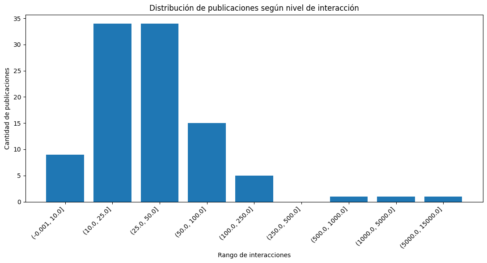
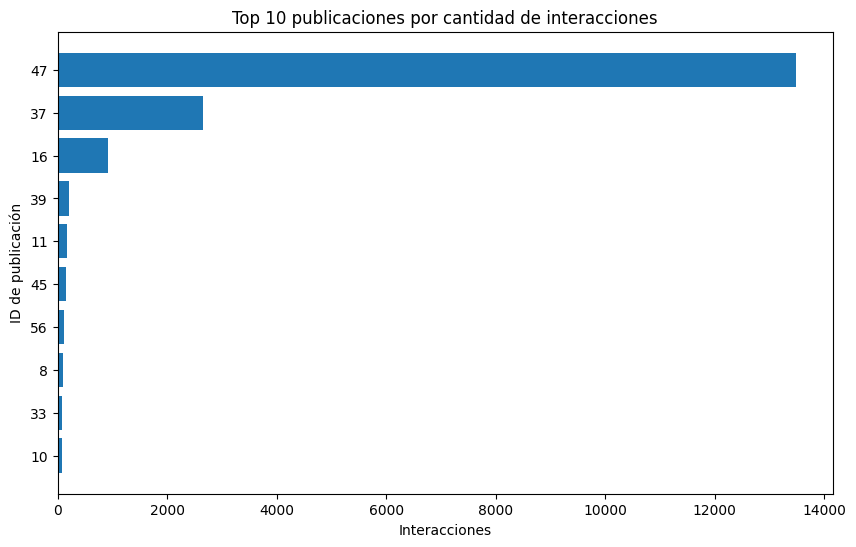
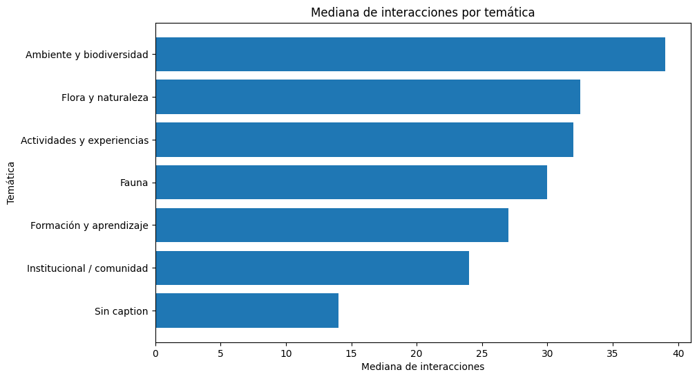
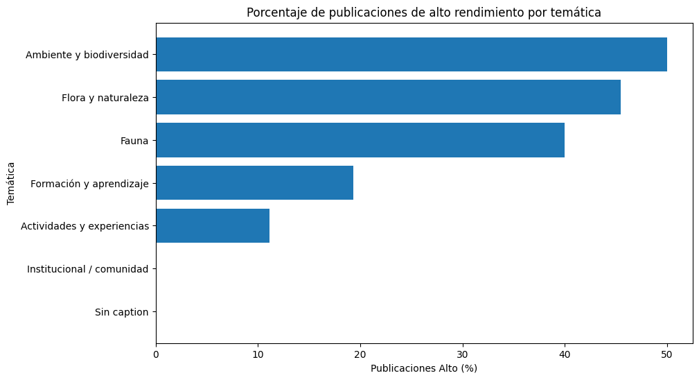
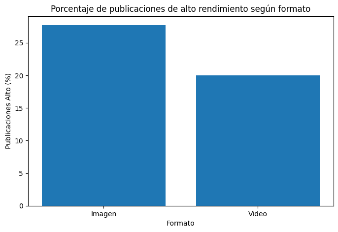
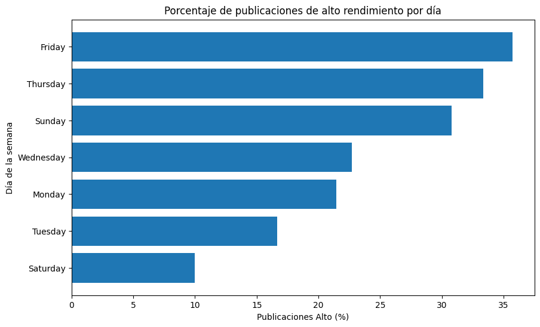
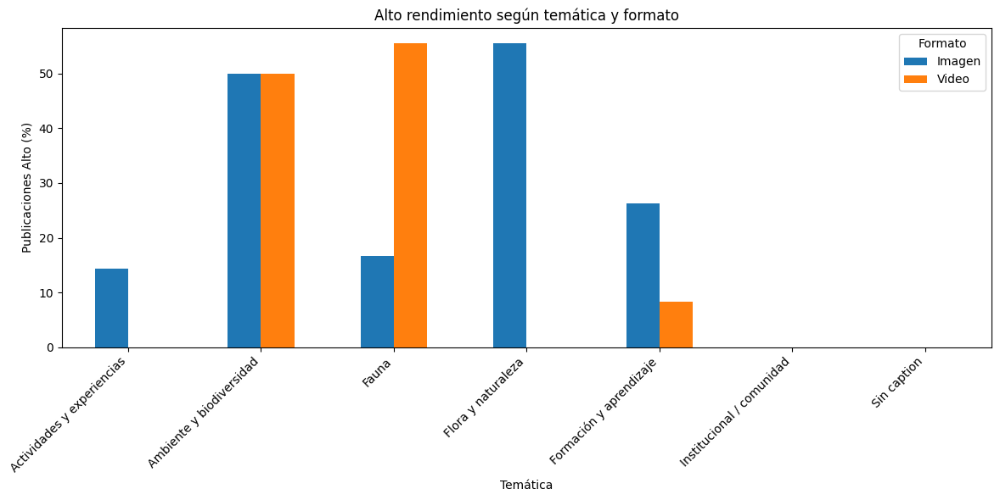

# Análisis de Instagram — Fundación Aprender Haciendo

## 📊 Proyecto de Ciencia de Datos

Análisis exploratorio de datos (EDA) aplicado a publicaciones de Instagram de la **Fundación Aprender Haciendo**, desarrollado como parte de una práctica profesional.

El proyecto busca analizar el comportamiento de las publicaciones, identificar patrones de interacción y generar información que pueda contribuir a la planificación y comunicación de contenidos digitales.

---

## 🎯 Objetivos

- Analizar el comportamiento de las publicaciones de Instagram.
- Identificar patrones de interacción.
- Comparar el rendimiento según temática y formato.
- Analizar días y horarios de publicación.
- Estudiar características de los textos y hashtags.
- Identificar publicaciones con niveles elevados de interacción.
- Generar visualizaciones para facilitar la interpretación de los resultados.
- Elaborar conclusiones basadas en los datos analizados.

---

## 📁 Dataset

El análisis se realizó sobre una muestra de **100 publicaciones públicas** de Instagram.

Entre las variables utilizadas se encuentran:

- `likeCount`
- `commentCount`
- `isVideo`
- `postDate`
- `caption`
- `postUrl`

A partir de estas variables se generaron nuevas características para el análisis.

---

## 🔄 Proceso de trabajo

El proyecto siguió distintas etapas del proceso de Ciencia de Datos:

**Extracción → ETL → Limpieza → Transformación → EDA → Análisis → Visualización → Interpretación**

### ETL y preparación de datos

Se realizaron tareas de:

- limpieza de datos;
- tratamiento de valores faltantes;
- normalización de textos;
- transformación de fechas;
- extracción de día y hora;
- cálculo de longitud de captions;
- identificación y conteo de hashtags;
- procesamiento de palabras;
- eliminación de palabras vacías (stopwords);
- clasificación temática de las publicaciones.

---

## 🐍 Herramientas utilizadas

- Python
- Pandas
- Matplotlib
- Google Colab
- Microsoft Excel

---

## 📈 Principales análisis

El proyecto contempla el análisis de:

### Interacciones

Se analizaron `likes` y `comentarios`, considerando medidas como:

- media;
- mediana;
- desviación estándar;
- valores mínimos y máximos;
- distribución de las interacciones.

### Contenido

Se analizaron:

- longitud de las publicaciones;
- hashtags;
- palabras más frecuentes;
- agrupaciones de palabras;
- temáticas de las publicaciones.

### Temporalidad

Se analizaron:

- día de la semana;
- hora de publicación;
- franjas horarias.

### Formato

Se compararon publicaciones:

- con video;
- sin video.

### Temáticas

Las publicaciones fueron clasificadas en diferentes categorías para analizar su comportamiento y nivel de interacción.

---

## 📊 Visualizaciones

El análisis incluye diferentes visualizaciones orientadas a identificar patrones de interacción, contenido, formato y temporalidad.

### Distribución de interacciones

La distribución permite observar la fuerte asimetría presente en los datos y la influencia de valores extremos.

---

### Top 10 publicaciones por interacción

Las 10 publicaciones con mayor interacción concentran el **87,19 % del total de interacciones** de la muestra.

---

### Interacciones por temática

Se utiliza la mediana como medida central debido a la presencia de valores extremos.

---

### Publicaciones de alto rendimiento por temática

Comparación del porcentaje de publicaciones clasificadas como **Alto** dentro de cada temática.

---

### Alto rendimiento según formato

Comparación entre publicaciones con imagen y publicaciones con video.

---

### Alto rendimiento según día de la semana

Distribución porcentual de publicaciones clasificadas como **Alto** según el día de publicación.

---

### Temática × formato × rendimiento

Análisis conjunto entre temática, formato y nivel de interacción.

---

## 🔎 Resultados destacados

Uno de los principales hallazgos fue la elevada concentración de interacciones en un grupo reducido de publicaciones.

Dentro de las 100 publicaciones analizadas:

- **Interacciones totales:** 20.616
- **Interacciones del Top 10:** 17.975
- **Concentración del Top 10:** 87,19 %
- **Mediana de interacciones:** 28,5
- **Promedio de interacciones:** 206,16

La diferencia entre media y mediana evidencia una distribución fuertemente asimétrica, influenciada por algunas publicaciones con valores excepcionalmente elevados.

---

## 📌 Consideraciones metodológicas

Los resultados corresponden a una muestra de publicaciones públicas y representan el comportamiento observado dentro del período y conjunto de datos analizado.

Por lo tanto, los resultados deben interpretarse como evidencia descriptiva de la muestra y no como una generalización absoluta sobre todo el contenido histórico de la cuenta.

---

## 👨‍💻 Autor

**Marcelo Javier Werner**

Estudiante de Licenciatura en Ciencia de Datos  
Técnico Superior en Programación

**SerWer Data Lab**

---

## 📄 Proyecto

Este repositorio forma parte de un proyecto de análisis de datos desarrollado en el marco de una práctica profesional con **Fundación Aprender Haciendo**.
